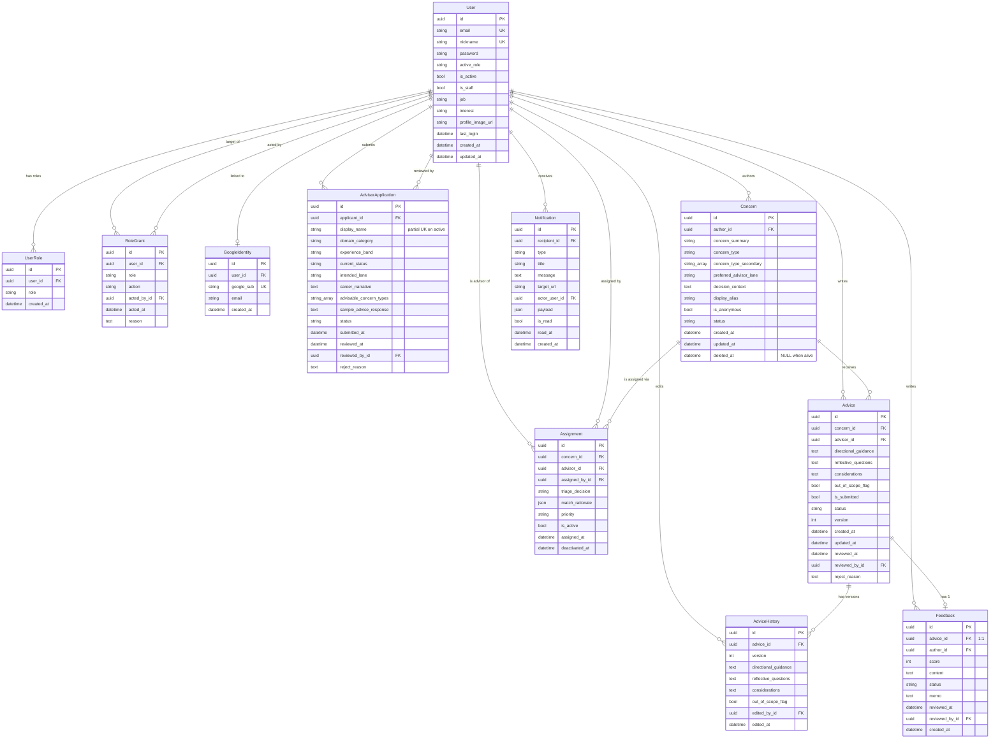

# Data Model v1

본 문서는 `chamneul` Phase 2 v1의 정식 데이터 모델 명세이다. `docs/api.md` v1 (43 엔드포인트)과 1:1 정합하며, Owner가 2026-06-26 정합 세션에서 확정한 8개 핵심 결정(M1~M8)과 4개 production-grade 보완사항(UUIDv7 / 부분 unique / 3단계 마이그레이션 / 읽기 replica)을 반영한다.

본 문서의 출처:

* CLAUDE.md (2026-06-26 갱신본 — PG 전용 정책 §4 + soft-delete `deleted_at` 컨벤션 §6.6 흡수, 이후 헌법 잠금)
* ADR-001 (로컬 컨테이너 아키텍처)
* ADR-002 (Session 인증 정책)
* ADR-003 (ADMIN 역할 부여/회수)
* docs/api.md v1
* docs/learning/01-api-to-model-and-docker.md (Owner 학습 세션)

본 문서는 코드를 생성하지 않는다. 본 명세 확정 후 별도 코드 세션에서 Django 스캐폴딩으로 이어진다.

---

## 1. Common

### 1.1 Database & Engine Policy

* **PostgreSQL 16+ 전용** (CLAUDE.md §4). SQLite는 어느 단계에서도 사용하지 않는다.
* ORM: Django ORM (DRF는 직렬화 계층). 마이그레이션은 Django의 `makemigrations` / `migrate` 결과 파일을 단일 진실원천으로 삼는다.
* 트랜잭션 격리 수준: PG 기본(`READ COMMITTED`). 단, 다중 쓰기 액션(역할 부여, advice 승인, 배정/취소 등)은 `@transaction.atomic`으로 묶는다.
* Timezone: 서버 저장은 UTC (`USE_TZ = True`, `TIME_ZONE = "UTC"`), API 응답은 KST(`+09:00`)로 직렬화 (api.md §1.7).

### 1.2 Primary Key Strategy — UUIDv7 (Owner 보완사항 #1)

* 모든 PK는 **UUIDv7**. PG 16+에서 시계열 정렬되는 UUID를 사용해 B-Tree 페이지 무작위 플러시 문제를 회피한다 (UUIDv4 대비 인덱스 효율).
* 구현: PG의 `gen_random_uuid()` 만으로는 UUIDv4이므로 별도 처리.
  * 1차 안: **앱 레벨 생성** — `default=uuid7` 헬퍼 (`common/uuid7.py`)를 모델 `id`의 default로 사용. RFC 9562 구현체(`uuid_utils.uuid7` 또는 자체 구현)를 채택.
  * 2차 안(PG 17+ 정식 채택 시): `pg_uuidv7` extension + `DEFAULT uuidv7()`로 이전.
* 모든 모델은 다음 공통 PK 정의:
  ```python
  id = models.UUIDField(primary_key=True, default=uuid7, editable=False)
  ```
* 외부 노출 시 string 표기(`"018f7c0e-..."`). api.md 의 path-parameter(`{concern-id}`, `{user-id}`, …)는 UUID 문자열을 받는다.
* **수용 이유**: BigAutoField는 DB 시퀀스에 결속되어 분산(sharding/multi-region)/스테이징→프로덕션 데이터 이관 시 PK 충돌을 유발. UUIDv7은 EKS-MSA 무상태 아키텍처와 자연 정합 (Owner M6 결정 근거).

### 1.3 Enum 구현

* Django `TextChoices` 만 사용. PG 네이티브 `ENUM` 타입은 사용하지 않는다 (변경 시 마이그레이션 부담).
* DB 저장은 `VARCHAR(...)`. 코드의 enum 값 추가는 마이그레이션 없이 가능하며, 기존 값 변경은 데이터 마이그레이션이 필요하다.
* 무결성은 `validators` + Service Layer 이중 검증으로 보완한다.

### 1.4 Soft Delete 컨벤션 (CLAUDE.md §6.6)

* `deleted_at: DateTimeField(null=True, blank=True, default=None)` 컬럼으로 표현.
* 활성 판별: `deleted_at IS NULL`.
* Phase 2 v1 에서 soft delete 가 적용되는 모델: **`Concern` 1건**.
* Manager 패턴 (Owner M3):
  ```python
  class ConcernManager(models.Manager):
      def get_queryset(self):
          return super().get_queryset().filter(deleted_at__isnull=True)
      def with_deleted(self):
          return super().get_queryset()
      def alive(self):  # 명시적 alias
          return self.get_queryset()
  ```
* 기본 `objects` 매니저는 자동으로 deleted 를 제외한다 (Owner M3). 관리자/감사 목적의 조회는 `Concern.objects.with_deleted()`를 명시적으로 호출해야 한다.

### 1.5 Soft Delete + Unique 강제 패턴 (CLAUDE.md §6.6 / Owner 보완사항 #2)

Soft delete 가 적용된 모델에서 unique 컬럼이 등장하면 반드시 **부분 unique 인덱스**를 사용한다.

```python
class Meta:
    constraints = [
        models.UniqueConstraint(
            fields=["<unique_field>"],
            condition=Q(deleted_at__isnull=True),
            name="<table>_<field>_unique_active",
        ),
    ]
```

* Phase 2 v1 에서 `Concern` 은 자체 unique 컬럼이 없어 직접 적용 케이스는 없으나, 본 규칙은 향후 soft delete 확대 시(예: User suspension/withdrawal) 자동 적용된다.
* 단순 `unique=True` 만으로 끝내는 모델 정의는 코드 리뷰에서 reject 한다.

### 1.6 Audit 패턴

다음 두 audit 테이블을 둔다.

* `RoleGrant` — 역할 부여/회수 이력 (ADR-003)
* `AdviceHistory` — 조언 본문 버전 이력 (CLAUDE.md §6.7, Owner M7: 본문 전체 snapshot)

추가 audit는 Phase 2 v1 범위에 포함하지 않는다.

### 1.7 PostgreSQL 전용 필드 (CLAUDE.md §4 허용 목록)

| 사용처 | 필드 | 비고 |
| --- | --- | --- |
| `Concern.concern_type_secondary` | `ArrayField(CharField(40))` | taxonomy enum 키 배열, 최대 2개 |
| `AdvisorApplication.advisable_concern_types` | `ArrayField(CharField(40))` | taxonomy enum 키 배열, 1개 이상 |
| `Assignment.match_rationale` | `JSONField(default=dict)` | `{matched_types[], lane_match, note}` |
| `Notification.payload` | `JSONField(default=dict)` | 알림 타입별 부가 정보 |

GIN 인덱스는 검색 패턴이 확정되는 시점에 추가한다 (Phase 2 v1 에서는 모두 PK/FK 인덱스로 충분 — Open Question O-5).

### 1.8 App 레이아웃 (Owner M1)

```
chamneul/
├── manage.py
├── config/            ← settings, urls, /healthz
├── common/            ← 공통 권한 / 페이지네이션 / 예외 핸들러 / uuid7 헬퍼 / DB router
├── accounts/          ← User, UserRole, RoleGrant, GoogleIdentity
├── advisors/          ← AdvisorApplication
├── concerns/          ← Concern, Assignment
├── advice/            ← Advice, AdviceHistory, Feedback
└── notifications/     ← Notification
```

* 결합도 최소화를 위해 헌법 §3 의 5 도메인 앱 구조를 유지하되, Google OAuth / RoleGrant 는 `accounts/` 안에, Feedback 은 `advice/` 안에 둔다.
* 앱 간 모델 참조는 항상 문자열 참조(`"accounts.User"`) 로 한다 (cyclic import 회피).

### 1.9 일관 컬럼 패턴

모든 모델은 명시적으로 다음 패턴을 따른다.

* `id` — UUIDv7 PK (§1.2)
* `created_at` — `DateTimeField(auto_now_add=True)`
* `updated_at` — `DateTimeField(auto_now=True)` (변경 가능 모델만)
* Soft delete 모델은 추가로 `deleted_at` (§1.4)

---

## 2. ERD (Mermaid)



---

## 3. Entity Specifications

### 3.1 `User` (accounts/)

**책임**: 인증 주체. 이메일 단일 로그인. 역할 다중 보유 가능 (UserRole 별도 모델).

**기반 클래스**: `AbstractBaseUser + PermissionsMixin` (Owner M2). 커스텀 `UserManager`(`BaseUserManager` 상속) 필수.

| 필드 | 타입 | Null | Default | 제약 | 비고 |
| --- | --- | --- | --- | --- | --- |
| id | UUIDField | N | uuid7() | PK | §1.2 |
| email | EmailField | N | – | unique | `USERNAME_FIELD` |
| nickname | CharField(20) | N | – | unique, min_length=2 | `REQUIRED_FIELDS` (Q14) |
| password | CharField(128) | N | – | – | `AbstractBaseUser`에서 PBKDF2 해싱 |
| active_role | CharField(8) | N | "USER" | TextChoices `ActiveRole` | api.md 10 |
| is_active | BooleanField | N | True | – | Django 표준 계정 활성 플래그 (정지/탈퇴는 Phase 3+) |
| is_staff | BooleanField | N | False | – | Django Admin 접근 권한 (createsuperuser → True) |
| job | CharField(50) | Y | "" | – | api.md 8 |
| interest | CharField(200) | Y | "" | – | api.md 8 |
| profile_image_url | URLField(500) | Y | "" | – | api.md 8 |
| last_login | DateTimeField | Y | None | – | `AbstractBaseUser` 기본 |
| created_at | DateTimeField | N | auto | – | – |
| updated_at | DateTimeField | N | auto | – | – |

**Enum** — `ActiveRole`:
```python
class ActiveRole(models.TextChoices):
    USER = "USER", "사용자"
    ADVISOR = "ADVISOR", "조언가"
```
* `ADMIN` 은 active_role 후보가 아니다 (ADMIN은 권한 검사 시 항상 적용; api.md §2).

**Manager**:
```python
class UserManager(BaseUserManager):
    def create_user(self, email, nickname, password, **extra):
        # email 소문자 정규화 + 해싱
        ...
    def create_superuser(self, email, nickname, password, **extra):
        # is_staff=True, is_superuser=True; ADMIN 역할은 별도 UserRole row로 추가 (ADR-003)
        ...
```

**Unique**: `email`, `nickname`. (현재 soft delete 없음 → 단순 unique 사용 가능. 향후 soft delete 도입 시 CLAUDE.md §6.6 partial unique 패턴 자동 적용.)

**Indexes**: unique constraints가 자동 생성하는 인덱스 외 추가 없음.

**`USERNAME_FIELD` / `REQUIRED_FIELDS`**:
```python
USERNAME_FIELD = "email"
REQUIRED_FIELDS = ["nickname"]   # createsuperuser 프롬프트
EMAIL_FIELD = "email"
```

**API 매핑**: 2, 3, 4, 5, 6, 7, 8.

---

### 3.2 `UserRole` (accounts/)

**책임**: User ↔ Role(`ADMIN`/`ADVISOR`) 의 M:N. `USER` 는 row 가 없는 default 역할 (CLAUDE.md §6 의 도메인 의도).

| 필드 | 타입 | Null | Default | 제약 | 비고 |
| --- | --- | --- | --- | --- | --- |
| id | UUIDField | N | uuid7() | PK | – |
| user | FK(User, PROTECT) | N | – | – | related_name="role_assignments" |
| role | CharField(8) | N | – | TextChoices `Role` | ADMIN / ADVISOR |
| created_at | DateTimeField | N | auto | – | – |

**Enum** — `Role`:
```python
class Role(models.TextChoices):
    USER = "USER", "사용자"      # logical default only — row 없음
    ADVISOR = "ADVISOR", "조언가"
    ADMIN = "ADMIN", "관리자"
```
※ `UserRole`의 `role` 컬럼에는 `ADVISOR`/`ADMIN` 만 저장한다 (`USER` 저장 금지 — Service Layer + `clean()`에서 차단).

**Unique**: `(user, role)`.

**Indexes**:
* `(user, role)` — unique constraint가 자동 생성.

**API 매핑**: 9, 10, 42, 43.

---

### 3.3 `RoleGrant` (accounts/) — Audit

**책임**: 역할 부여/회수 이력. ADR-003 §3.

| 필드 | 타입 | Null | Default | 제약 | 비고 |
| --- | --- | --- | --- | --- | --- |
| id | UUIDField | N | uuid7() | PK | – |
| user | FK(User, PROTECT) | N | – | – | 대상 사용자, related_name="received_role_events" |
| role | CharField(8) | N | – | `Role` (ADMIN/ADVISOR) | – |
| action | CharField(8) | N | – | TextChoices `RoleGrantAction` | GRANT / REVOKE |
| acted_by | FK(User, PROTECT) | N | – | – | 수행 관리자, related_name="performed_role_events" |
| acted_at | DateTimeField | N | auto_now_add | – | – |
| reason | TextField | Y | "" | – | – |

**Enum** — `RoleGrantAction`: `GRANT`, `REVOKE`.

**Indexes**:
* `(user, acted_at desc)` — 대상자별 이력
* `(acted_at desc)` — 전역 감사 뷰

**API 매핑**: 42, 43 (직접). 15(APPROVED 시 부수효과로 GRANT 1건 자동 기록).

---

### 3.4 `GoogleIdentity` (accounts/)

**책임**: Google OAuth 식별자와 User 연결. 동일 검증 이메일이면 기존 User에 OAuth 식별자만 추가 링크 (ADR-002 §7).

| 필드 | 타입 | Null | Default | 제약 | 비고 |
| --- | --- | --- | --- | --- | --- |
| id | UUIDField | N | uuid7() | PK | – |
| user | OneToOneField(User, CASCADE) | N | – | unique | – |
| google_sub | CharField(255) | N | – | unique | Google의 `sub` |
| email | EmailField | N | – | – | Google이 assert한 이메일 (User.email과 다를 수 있음) |
| created_at | DateTimeField | N | auto | – | – |

**Unique**: `google_sub`, `user` (OneToOne).

**API 매핑**: 5, 6.

---

### 3.5 `AdvisorApplication` (advisors/)

**책임**: 조언가 신청서. PENDING → REVIEWING → APPROVED/REJECTED. APPROVED 시 부수효과로 `UserRole(ADVISOR)` 추가 + `RoleGrant(GRANT)` audit + 알림 발송.

| 필드 | 타입 | Null | Default | 제약 | 비고 |
| --- | --- | --- | --- | --- | --- |
| id | UUIDField | N | uuid7() | PK | – |
| applicant | FK(User, PROTECT) | N | – | – | related_name="advisor_applications" |
| display_name | CharField(20) | N | – | partial unique on active | Q22, advisor 프로필명 |
| domain_category | CharField(20) | N | – | TextChoices `DomainCategory` | O-1 |
| experience_band | CharField(8) | N | – | TextChoices `ExperienceBand` | `5-7` / `8-12` / `13+` |
| current_status | CharField(10) | N | – | TextChoices `CurrentStatus` | 재직/프리랜서/휴직/휴식/은퇴 |
| intended_lane | CharField(8) | N | – | TextChoices `IntendedLane` | expert/senior. **응답 노출 금지** (CLAUDE.md §6.1) |
| career_narrative | TextField | N | – | – | – |
| advisable_concern_types | ArrayField(CharField(40)) | N | list | 1개 이상 | taxonomy enum 키 |
| sample_advice_response | TextField | N | – | min_length=200, max_length=400 | – |
| status | CharField(12) | N | "PENDING" | TextChoices `AdvisorApplicationStatus` | – |
| submitted_at | DateTimeField | N | auto_now_add | – | – |
| reviewed_at | DateTimeField | Y | None | – | – |
| reviewed_by | FK(User, PROTECT, null=True) | Y | None | – | related_name="reviewed_advisor_applications" |
| reject_reason | TextField | Y | "" | – | – |

**Enums**:
* `AdvisorApplicationStatus`: PENDING / REVIEWING / APPROVED / REJECTED / WITHDRAWN
* `DomainCategory`: IT / 경영 / 인사 / 금융 / 의료 / 교육 / 기타 (O-1로 확정 필요)
* `ExperienceBand`: `5-7` / `8-12` / `13+`
* `CurrentStatus`: 재직 / 프리랜서 / 휴직 / 휴식 / 은퇴
* `IntendedLane`: expert / senior

**상태 전이 규칙** (Service Layer 강제):
* `PENDING → REVIEWING → APPROVED|REJECTED`
* `WITHDRAWN`은 Phase 2 v1 API에서 도달 불가 (model enum만 보유)
* 종결 상태(APPROVED/REJECTED/WITHDRAWN)에서 재전이는 409.

**Unique** (Partial — Q22 + CLAUDE.md §6.6 정합):
```python
constraints = [
    models.UniqueConstraint(
        fields=["display_name"],
        condition=Q(status__in=["PENDING", "REVIEWING", "APPROVED"]),
        name="advisor_app_display_name_unique_active",
    ),
]
```
* REJECTED/WITHDRAWN 신청서의 display_name은 재사용 가능. 추후 동일 사용자의 재신청 시 충돌 방지.

**Indexes**:
* `(status, submitted_at desc)` — 관리자 목록
* `(applicant, submitted_at desc)` — 내 신청 조회

**API 매핑**: 11, 12, 13, 14, 15.

---

### 3.6 `Concern` (concerns/)

**책임**: 사용자가 작성한 의사결정 고민. 상태 머신 + soft delete.

| 필드 | 타입 | Null | Default | 제약 | 비고 |
| --- | --- | --- | --- | --- | --- |
| id | UUIDField | N | uuid7() | PK | – |
| author | FK(User, PROTECT) | N | – | – | related_name="concerns" |
| concern_summary | CharField(100) | N | – | – | api.md 16: ≤100자 |
| concern_type | CharField(40) | N | – | TextChoices `ConcernType` | taxonomy 11값 (CLAUDE.md §6.5) |
| concern_type_secondary | ArrayField(CharField(40)) | N | list | size<=2, 각 값 ConcernType | – |
| preferred_advisor_lane | CharField(16) | N | "no_preference" | TextChoices `PreferredAdvisorLane` | expert/senior/no_preference |
| decision_context | TextField | N | "" | max_length=4000 (O-2) | – |
| display_alias | CharField(50) | N | "" | – | 익명 표시명 |
| is_anonymous | BooleanField | N | True | – | – |
| status | CharField(12) | N | "SUBMITTED" | TextChoices `ConcernStatus` | – |
| deleted_at | DateTimeField | Y | None | – | §1.4 soft delete |
| created_at | DateTimeField | N | auto | – | – |
| updated_at | DateTimeField | N | auto | – | – |

**Enums**:
* `ConcernStatus`: SUBMITTED / ASSIGNED / ANSWERED / CLOSED (CLAUDE.md §6.6)
* `ConcernType` (11값, CLAUDE.md §6.5): career_transition, job_change, burnout, startup_failure, leadership, relationship, life_direction, major_life_decision, education_choice, relocation, finance_major_decision
* `PreferredAdvisorLane`: expert / senior / no_preference

**상태 전이** (CLAUDE.md §6.6):
* `SUBMITTED → ASSIGNED` (관리자 첫 배정)
* `ASSIGNED → ANSWERED` (첫 APPROVED advice 부착)
* `ANSWERED → CLOSED` (Phase 2 v1에서는 Django Admin으로만, O-3)
* `ASSIGNED → SUBMITTED` (모든 배정 비활성)

**Manager**: §1.4 패턴 (`objects` = alive only, `with_deleted()` 명시).

**Indexes**:
* `(author, deleted_at, created_at desc)` — 내 고민 목록 (deleted_at은 NULL/NOT NULL 선택성을 잘 살림)
* `(status, created_at desc)` — 관리자 목록
* `(concern_type, created_at desc)` — 분류별 통계용 (O-5)

**API 매핑**: 16, 17, 18, 19, 22, 23.

---

### 3.7 `Assignment` (concerns/)

**책임**: Concern ↔ Advisor 의 N:M 관계 테이블. 자체 속성(`triage_decision`, `priority`, `match_rationale`, `is_active`)을 가지므로 명시 모델.

| 필드 | 타입 | Null | Default | 제약 | 비고 |
| --- | --- | --- | --- | --- | --- |
| id | UUIDField | N | uuid7() | PK | – |
| concern | FK(Concern, PROTECT) | N | – | – | related_name="assignments" |
| advisor | FK(User, PROTECT) | N | – | – | related_name="advisor_assignments" |
| assigned_by | FK(User, PROTECT) | N | – | – | related_name="performed_assignments" |
| triage_decision | CharField(20) | N | – | TextChoices `TriageDecision` | suitable/needs_more_info/out_of_scope |
| match_rationale | JSONField | N | dict | – | `{matched_types[], lane_match, note}` |
| priority | CharField(8) | N | "normal" | TextChoices `Priority` | low/normal/high |
| is_active | BooleanField | N | True | – | 비활성 보존 (감사 로그) |
| assigned_at | DateTimeField | N | auto_now_add | – | – |
| deactivated_at | DateTimeField | Y | None | – | – |

**Enums**:
* `TriageDecision`: suitable / needs_more_info / out_of_scope
* `Priority`: low / normal / high

**Unique** (Partial — CLAUDE.md §6.6 partial unique 원칙을 `is_active` 로 일반화 적용):
```python
constraints = [
    models.UniqueConstraint(
        fields=["concern", "advisor"],
        condition=Q(is_active=True),
        name="assignment_concern_advisor_unique_active",
    ),
]
```
* 동일 (concern, advisor) 의 활성 배정은 1개만. 비활성 history 는 다수 허용.

**Indexes**:
* `(advisor, is_active)` — 배정 받은 고민 목록
* `(concern, is_active)` — concern 별 활성 배정 카운트

**API 매핑**: 20, 21, 24, 25.

---

### 3.8 `Advice` (advice/)

**책임**: 조언. PENDING/REVIEWING 에서만 advisor 수정 가능. 관리자 review로 APPROVED/REJECTED. version 은 audit 용 증가 카운터.

| 필드 | 타입 | Null | Default | 제약 | 비고 |
| --- | --- | --- | --- | --- | --- |
| id | UUIDField | N | uuid7() | PK | – |
| concern | FK(Concern, PROTECT) | N | – | – | related_name="advices" |
| advisor | FK(User, PROTECT) | N | – | – | related_name="written_advices" |
| directional_guidance | TextField | N | – | max_length=1500 (api.md 28) | – |
| reflective_questions | TextField | N | "" | – | – |
| considerations | TextField | N | "" | – | – |
| out_of_scope_flag | BooleanField | N | False | – | – |
| is_submitted | BooleanField | N | True | – | submit=false (draft) 표현 |
| status | CharField(10) | N | "PENDING" | TextChoices `AdviceStatus` | – |
| version | PositiveIntegerField | N | 1 | – | CLAUDE.md §6.7 |
| created_at | DateTimeField | N | auto | – | – |
| updated_at | DateTimeField | N | auto | – | – |
| reviewed_at | DateTimeField | Y | None | – | – |
| reviewed_by | FK(User, PROTECT, null=True) | Y | None | – | related_name="reviewed_advices" |
| reject_reason | TextField | Y | "" | – | – |

**Enum** — `AdviceStatus`: PENDING / REVIEWING / APPROVED / REJECTED / DELETED (CLAUDE.md §6.2)

**상태 전이**:
* `PENDING ↔ REVIEWING` (관리자가 REVIEWING 으로 옮길 수 있음 — 단, 직접 전이 API는 33의 review action에서만)
* `PENDING|REVIEWING → APPROVED|REJECTED` (33)
* `PENDING|REVIEWING → DELETED` (30, advisor가 본인 advice 삭제)
* `APPROVED → DELETED` 는 Django Admin 만 (Phase 2 v1 Public API 미제공)

**Unique** (Partial — Q10 + 재작성 가능성 고려 O-4):
```python
constraints = [
    models.UniqueConstraint(
        fields=["concern", "advisor"],
        condition=~Q(status="DELETED"),
        name="advice_concern_advisor_unique_active",
    ),
]
```
* 동일 (concern, advisor) 활성 advice 1건. DELETED 후 동일 advisor 가 새 advice 작성 가능.

**Indexes**:
* `(advisor, created_at desc)` — 내가 작성한 조언 목록
* `(concern, status)` — concern 상세에서 APPROVED 필터
* `(status, created_at desc)` — 관리자 review 목록 (`?status=PENDING` 기본)

**API 매핑**: 26, 27, 28, 29, 30, 31, 32, 33.

---

### 3.9 `AdviceHistory` (advice/) — Audit

**책임**: advice 수정 시점의 본문 전체 snapshot (Owner M7).

| 필드 | 타입 | Null | Default | 제약 | 비고 |
| --- | --- | --- | --- | --- | --- |
| id | UUIDField | N | uuid7() | PK | – |
| advice | FK(Advice, CASCADE) | N | – | – | related_name="history" |
| version | PositiveIntegerField | N | – | – | snapshot 시점의 advice.version |
| directional_guidance | TextField | N | – | – | snapshot |
| reflective_questions | TextField | N | – | – | snapshot |
| considerations | TextField | N | – | – | snapshot |
| out_of_scope_flag | BooleanField | N | – | – | snapshot |
| edited_by | FK(User, PROTECT) | N | – | – | – |
| edited_at | DateTimeField | N | auto_now_add | – | – |

**Unique**: `(advice, version)`.

**Indexes**: `(advice, version)` — unique constraint가 자동 생성.

**Side Effect 매핑**: 29 (수정마다 1행 추가).

**비고**: `CASCADE`로 advice 삭제 시 history 도 함께 삭제. (DELETED 상태로의 soft delete가 아니라 실제 row 삭제가 일어나는 경우 — Phase 2 v1 에서는 Public API 상 발생하지 않음 / Django Admin 에서의 hard delete 시 동작.)

---

### 3.10 `Feedback` (advice/)

**책임**: 사용자가 받은 advice 에 대한 피드백. advice 당 1건.

| 필드 | 타입 | Null | Default | 제약 | 비고 |
| --- | --- | --- | --- | --- | --- |
| id | UUIDField | N | uuid7() | PK | – |
| advice | OneToOneField(Advice, PROTECT) | N | – | unique | related_name="feedback" |
| author | FK(User, PROTECT) | N | – | – | related_name="written_feedbacks" |
| score | PositiveSmallIntegerField | N | – | validators MinValueValidator(1), MaxValueValidator(5) | – |
| content | TextField | N | "" | – | – |
| status | CharField(10) | N | "SUBMITTED" | TextChoices `FeedbackStatus` | – |
| memo | TextField | N | "" | – | 관리자 memo |
| reviewed_at | DateTimeField | Y | None | – | – |
| reviewed_by | FK(User, PROTECT, null=True) | Y | None | – | related_name="reviewed_feedbacks" |
| created_at | DateTimeField | N | auto | – | – |

**Enum** — `FeedbackStatus`: SUBMITTED / REVIEWED / ARCHIVED (CLAUDE.md §6.3)

**상태 전이**: `SUBMITTED → REVIEWED → ARCHIVED` (역방향 불가, Service Layer 강제)

**Unique**: `advice` (OneToOne).

**Indexes**:
* `(status, created_at desc)` — 관리자 목록
* `(author, created_at desc)` — 내 피드백 목록

**API 매핑**: 34, 35, 36, 37, 38.

---

### 3.11 `Notification` (notifications/)

**책임**: 수신자별 알림. CLAUDE.md §6.4 5가지 타입.

| 필드 | 타입 | Null | Default | 제약 | 비고 |
| --- | --- | --- | --- | --- | --- |
| id | UUIDField | N | uuid7() | PK | – |
| recipient | FK(User, CASCADE) | N | – | – | related_name="notifications". recipient 삭제 시 알림도 정리. |
| type | CharField(40) | N | – | TextChoices `NotificationType` | – |
| title | CharField(200) | N | – | – | – |
| message | TextField | N | – | – | – |
| target_url | CharField(500) | N | "" | – | 상대 경로 (api.md §6) |
| actor_user | FK(User, SET_NULL, null=True) | Y | None | – | 알림을 유발한 주체 (있을 때만). related_name="triggered_notifications" |
| payload | JSONField | N | dict | – | 타입별 부가 정보 |
| is_read | BooleanField | N | False | – | – |
| read_at | DateTimeField | Y | None | – | – |
| created_at | DateTimeField | N | auto | – | – |

**Enum** — `NotificationType` (CLAUDE.md §6.4):
* ADVICE_APPROVED
* ADVICE_REJECTED
* ADVISOR_APPLICATION_APPROVED
* ADVISOR_APPLICATION_REJECTED
* ASSIGNMENT_CREATED

**Indexes**:
* `(recipient, is_read, created_at desc)` — 내 알림 목록 (unread_count 빠른 집계)
* `(recipient, created_at desc)` — fallback

**API 매핑**: 39, 40, 41. 생성 트리거: 15, 24, 33.

---

## 4. DB-Level Constraints (요약)

| 모델 | 제약 | 종류 |
| --- | --- | --- |
| User | `email` | UNIQUE |
| User | `nickname` | UNIQUE |
| UserRole | `(user, role)` | UNIQUE |
| GoogleIdentity | `google_sub` | UNIQUE |
| GoogleIdentity | `user` | UNIQUE (OneToOne) |
| AdvisorApplication | `display_name` WHERE status IN (PENDING, REVIEWING, APPROVED) | PARTIAL UNIQUE |
| Assignment | `(concern, advisor)` WHERE is_active=true | PARTIAL UNIQUE |
| Advice | `(concern, advisor)` WHERE status != DELETED | PARTIAL UNIQUE |
| AdviceHistory | `(advice, version)` | UNIQUE |
| Feedback | `advice` | UNIQUE (OneToOne) |

**FK on_delete 정책** (요약):
* `PROTECT` 기본 — 비즈니스 자산의 cascading 삭제 차단.
* `CASCADE` — `AdviceHistory → Advice`, `Notification → recipient(User)`.
* `SET_NULL` — `Notification.actor_user` (유발자가 떠나도 알림은 유지).
* `User.objects`는 Phase 2 v1에서 실 삭제를 발생시키지 않는다 (정지/탈퇴 흐름 없음 → PROTECT 위배 발생 가능성 0).

---

## 5. Service-Layer Constraints

DB로 표현 불가하지만 정합성에 필수인 규칙. Service Layer에서 명시 강제.

| 규칙 | 위치 | 출처 |
| --- | --- | --- |
| 자기 자신의 ADMIN 회수 금지 | `RoleService.revoke()` | ADR-003 |
| 마지막 ADMIN 회수 금지 | `RoleService.revoke()` | ADR-003 |
| AdvisorApplication 상태 전이 PENDING→REVIEWING→APPROVED/REJECTED | `AdvisorApplicationService.transition()` | api.md 15 |
| APPROVED 시 부수효과: UserRole(ADVISOR) + RoleGrant + Notification | `AdvisorApplicationService.approve()` | api.md 15 |
| Advice 작성 권한: 해당 concern에 active assignment 가진 advisor만 | `AdviceService.create()` | api.md 28 |
| Advice 수정 권한: 작성자 + status ∈ {PENDING, REVIEWING} | `AdviceService.update()` | api.md 29 |
| Advice version 증가 + AdviceHistory snapshot | `AdviceService.update()` | CLAUDE.md §6.7 |
| Advice review 부수효과: concern.status 자동 전이 + Notification | `AdviceReviewService.approve()/reject()` | api.md 33 |
| Concern 상태 자동 전이: ASSIGNED ↔ SUBMITTED on assignment activate/deactivate | `ConcernAssignmentService.assign()/unassign()` | CLAUDE.md §6.6 |
| Concern 상태 자동 전이: ASSIGNED → ANSWERED on first APPROVED advice | `AdviceReviewService.approve()` | CLAUDE.md §6.6 |
| Feedback 작성 가능 조건: advice.status=APPROVED + 본인이 concern 작성자 + 동일 advice 미작성 | `FeedbackService.create()` | api.md 34 |
| Feedback 상태 전이: SUBMITTED → REVIEWED → ARCHIVED (역방향 불가) | `FeedbackService.transition()` | api.md 38 |
| Assignment 중복 활성 차단: (concern, advisor)에 이미 active 배정이면 409 | DB 부분 unique + Service Layer 메시지 | api.md 24 |
| Assignment 비활성으로 인한 concern.status 되돌림 | `ConcernAssignmentService.unassign()` | api.md 25 |
| `intended_lane` Public 응답 제거 | Serializer 분리 (admin용 vs public) | CLAUDE.md §6.1 |
| `advisor_type` 응답 제거 | Serializer 정의 시 필드 자체 미포함 | Q15 |

Service Layer의 표준 위치: 각 앱 내 `services.py`. 트랜잭션 경계는 `@transaction.atomic` (학습 문서 A.4 / api.md 매핑 참조).

---

## 6. Index Summary

| 모델 | 인덱스 | 의도 | 쿼리 매핑 |
| --- | --- | --- | --- |
| User | `email` (unique) | 로그인 lookup | 3 |
| User | `nickname` (unique) | 중복 검증 | 2, 8 |
| UserRole | `(user, role)` (unique) | 권한 검사 | 모든 admin/advisor API |
| RoleGrant | `(user, acted_at desc)` | 대상별 이력 | (Django Admin) |
| RoleGrant | `(acted_at desc)` | 전역 감사 | (Django Admin) |
| GoogleIdentity | `google_sub` (unique) | OAuth 로그인 | 6 |
| AdvisorApplication | `(status, submitted_at desc)` | 관리자 목록 | 13 |
| AdvisorApplication | `(applicant, submitted_at desc)` | 내 신청 조회 | 12 |
| AdvisorApplication | display_name partial unique | 중복 차단 | 11 |
| Concern | `(author, deleted_at, created_at desc)` | 내 고민 목록 | 17 |
| Concern | `(status, created_at desc)` | 관리자 목록 | 22 |
| Concern | `(concern_type, created_at desc)` | 분류별 통계 | (관리 통계, 추후) |
| Assignment | `(advisor, is_active)` | 배정 받은 목록 | 20 |
| Assignment | `(concern, is_active)` | concern 활성 배정 수 | 23, 25 부수효과 |
| Assignment | `(concern, advisor)` partial unique | 중복 활성 차단 | 24 |
| Advice | `(advisor, created_at desc)` | 내 작성 조언 | 31 |
| Advice | `(concern, status)` | 고민 상세 APPROVED 필터 | 18, 23 |
| Advice | `(status, created_at desc)` | 관리자 review 목록 | 32 |
| Advice | `(concern, advisor)` partial unique | 1 advice 보장 | 28 |
| AdviceHistory | `(advice, version)` (unique) | 버전별 조회 | (audit) |
| Feedback | `advice` (unique) | 1:1 보장 + 중복 차단 | 34 |
| Feedback | `(status, created_at desc)` | 관리자 목록 | 36 |
| Feedback | `(author, created_at desc)` | 내 피드백 목록 | 35 |
| Notification | `(recipient, is_read, created_at desc)` | 미읽음 카운트 + 목록 | 39 |
| Notification | `(recipient, created_at desc)` | fallback | 39 |

GIN 인덱스 (Array/JSON 검색용)는 Phase 2 v1 에서는 추가하지 않는다. 검색 요구사항이 발생 시 O-5에서 다룬다.

---

## 7. Migration Notes (EKS 무중단 배포 인지 — Owner 보완사항 #3)

### 7.1 첫 마이그레이션 순서

앱 간 FK 의존성을 고려해 다음 순서로 작성한다 (실제 `makemigrations` 는 Django가 그래프로 자동 정렬하지만, 모델 구현 순서를 명시).

```
1) accounts.User (Custom user model — settings AUTH_USER_MODEL 등록 필수)
   → createsuperuser 가능해지는 첫 마일스톤
2) accounts.UserRole, RoleGrant, GoogleIdentity
3) advisors.AdvisorApplication
4) concerns.Concern, Assignment
5) advice.Advice, AdviceHistory, Feedback
6) notifications.Notification
```

**중요**: `AUTH_USER_MODEL` 은 **첫 마이그레이션 전**에 `settings.py`에 선언되어야 한다. 이후 변경은 데이터베이스 전체 재생성을 요구할 수 있다 (Django 제약).

### 7.2 3단계 Expand-Contract 마이그레이션 원칙 (Owner 보완사항 #3)

EKS 배포에서 구버전 파드가 새 스키마로 인해 에러를 유발하지 않도록, 하위 호환성을 깨뜨리는 모든 변경은 다음 **3단계로 분할**한다.

```
Step 1 — EXPAND   : 신규 컬럼/테이블 추가. 코드는 기존 컬럼을 계속 읽음. 신규 컬럼에 데이터 복사 (백필).
Step 2 — TRANSITION: 신규 코드 배포 → 읽기/쓰기 모두 신규 컬럼 사용. 구버전 파드도 정상 동작 (이중 쓰기 또는 호환 read).
Step 3 — CONTRACT : 구 컬럼/테이블 삭제. 모든 파드가 Step 2 코드로 교체된 후에만 실행.
```

적용 대상 (반드시 3단계):
* 컬럼 이름 변경 (`rename`)
* 컬럼 타입 변경 (호환 안 되는 변경)
* `NOT NULL` 제약 추가 (기존 NULL 데이터 backfill 필요)
* 컬럼 삭제
* 테이블 이름 변경 / 분리

직접 가능 (단일 마이그레이션 OK):
* 신규 컬럼 추가 with default (`NULL` 허용 또는 server_side default)
* 신규 인덱스 추가 (`CONCURRENTLY` 권장 — 대형 테이블 시)
* 신규 테이블 추가
* `CHECK` 제약 추가 (기존 데이터 위배 없음 확인 후)

PostgreSQL 인덱스 추가는 가능하면 `CREATE INDEX CONCURRENTLY` 를 사용한다 (Django `AddIndexConcurrently` Operation 활용). 트랜잭션 밖에서 실행되어 락 시간이 거의 0.

### 7.3 데이터 마이그레이션

* 스키마 마이그레이션과 데이터 마이그레이션을 같은 파일에 섞지 않는다 (롤백 어려움).
* 데이터 마이그레이션은 `RunPython` 으로 별도 파일에 둔다.
* 대용량 backfill 은 chunk(예: 1000건씩 + sleep) 로 처리해 long-running transaction 회피.

### 7.4 검증

* PR 단위: `python manage.py makemigrations --check --dry-run` CI 강제.
* 마이그레이션 적용 후: `python manage.py showmigrations --plan` 으로 순서/dependency 확인.
* 운영 적용 전 staging 에서 동일 마이그레이션 dry-run.

---

## 8. DB Routing & Read Replica Strategy (Owner 보완사항 #4)

### 8.1 정책

* Phase 2 v1 의 로컬 개발은 단일 PG 인스턴스 (Docker Compose). Replica 분기 없음.
* 운영(EKS + RDS) 전환 시점에는 다음 분기를 도입한다.
  * `default` — 기본(read/write, primary)
  * `replica` — 읽기 전용 (RDS Read Replica)

### 8.2 Django DATABASE_ROUTERS 골격

```python
# common/db_router.py — 학습용 골격, 실구현 세션에서 확정
class PrimaryReplicaRouter:
    def db_for_read(self, model, **hints):
        if hints.get("use_replica"):
            return "replica"
        return "default"
    def db_for_write(self, model, **hints):
        return "default"
    def allow_relation(self, obj1, obj2, **hints):
        return True
    def allow_migrate(self, db, app_label, **hints):
        return db == "default"
```

### 8.3 사용 가이드 (어떤 쿼리가 replica 후보인가)

다음 쿼리들은 `using("replica")` 명시 후보 (운영 단계 도입 시).

| API | 이유 |
| --- | --- |
| 13 GET /admin/advisor-applications | 관리자 목록, 무거운 정렬/필터 |
| 22 GET /admin/concerns | 동일 |
| 23 GET /admin/concerns/{id} | 관계형 prefetch 많음 |
| 32 GET /admin/advices | 동일 |
| 36 GET /admin/feedbacks | 동일 |
| 17 GET /users/me/concerns | 사용자 목록 (큰 사용자) |
| 26 GET /users/me/advices | 동일 |
| 31 GET /users/me/advices-written | 동일 |
| 39 GET /notifications | 자주 호출 + 캐시 가능 |

**주의**: 쓰기 직후 읽기(`POST → GET 동일 리소스`)는 primary 사용 (replica lag 회피). DRF View 레벨에서 `created`/`updated` 시점 분기.

### 8.4 Connection Pooling

* 로컬: psycopg 기본.
* 운영 진입 시 `pgbouncer` 또는 RDS Proxy 검토 (별도 ADR 예정).
* 파드별 커넥션 수 = (`MAX_CONNS` / `pod_count`) 보다 충분히 작게 설정.

### 8.5 인덱스 튜닝 가이드

* 모든 list API 는 (필터 컬럼들..., 정렬 컬럼) 복합 인덱스를 우선 검토.
* `EXPLAIN ANALYZE` 결과를 PR 본문에 첨부하는 관습 (운영 ㅇ유사 데이터 부피 후 강제).
* 인덱스 추가 마이그레이션은 `AddIndexConcurrently` 사용 (7.2).

---

## 9. Django Admin Notes

각 모델은 `app/admin.py` 에 다음 패턴으로 등록한다.

| 모델 | list_display | list_filter | search_fields | 비고 |
| --- | --- | --- | --- | --- |
| User | email, nickname, is_active, is_staff, created_at | is_active, is_staff | email, nickname | password 직접 변경 금지 (form 분리) |
| UserRole | user, role, created_at | role | user__email | – |
| RoleGrant | user, role, action, acted_by, acted_at | action, role | user__email, acted_by__email | readonly_fields 전체 (audit) |
| GoogleIdentity | user, google_sub, email | – | user__email, google_sub | readonly except link/unlink action |
| AdvisorApplication | applicant, display_name, status, submitted_at | status, domain_category | display_name, applicant__email | review action (approve/reject) |
| Concern | author, concern_summary, status, deleted_at, created_at | status, concern_type, deleted_at | concern_summary, author__email | soft delete 토글 action |
| Assignment | concern, advisor, is_active, assigned_at | is_active, priority | concern__id, advisor__email | – |
| Advice | concern, advisor, status, version, created_at | status | concern__id, advisor__email | review action |
| AdviceHistory | advice, version, edited_by, edited_at | – | advice__id | readonly (audit) |
| Feedback | advice, author, score, status, created_at | status, score | advice__id, author__email | – |
| Notification | recipient, type, is_read, created_at | type, is_read | recipient__email, title | – |

Phase 2 v1 의 Owner 운영 시나리오:
1. createsuperuser → 첫 ADMIN.
2. Django Admin 으로 advisor 신청 검토 / 승인.
3. Django Admin 으로 concern → advisor 배정.
4. Django Admin 으로 advice 승인.
5. 위 흐름이 Public API 와 1:1 정합함을 smoke test 로 검증.

---

## 10. Validation Checklist

본 명세대로 모델 코드가 작성되었는지 확인하는 체크리스트.

* [ ] `AUTH_USER_MODEL = "accounts.User"` 가 `settings.py` 에 첫 마이그레이션 전 선언됨.
* [ ] 모든 모델의 PK 가 UUIDField(default=uuid7).
* [ ] 모든 모델에 `created_at` 존재 (변경 가능 모델은 `updated_at` 도).
* [ ] Concern 만 `deleted_at` 보유.
* [ ] AdvisorApplication / Assignment / Advice 의 부분 unique 제약이 마이그레이션 SQL 에 `WHERE` 절로 등장.
* [ ] 모든 enum 이 TextChoices 로 정의되어 있고, DB column type 이 VARCHAR.
* [ ] FK on_delete 가 본 문서 §4 표와 일치 (PROTECT/CASCADE/SET_NULL).
* [ ] `Concern.objects` 가 deleted 미포함, `Concern.objects.with_deleted()` 가 전체 반환.
* [ ] Admin 등록이 §9 표와 일치.
* [ ] `python manage.py makemigrations --check --dry-run` 깨끗.
* [ ] `python manage.py migrate` 가 빈 PG DB 에서 성공.
* [ ] `python manage.py createsuperuser` 후 ADMIN UserRole row 가 추가됨 (createsuperuser hook).

---

## 11. Open Questions

본 명세 작성 중 결정 보류한 항목. **차단 결정 아님** — 코드 작업 중 / 또는 첫 smoke test 전 확정.

* **O-1**. `AdvisorApplication.domain_category` 의 enum 정확한 값 목록. 본 문서 잠정안: `IT / 경영 / 인사 / 금융 / 의료 / 교육 / 기타`. 사업 도메인 검토 후 확정 필요.
* **O-2**. `Concern.decision_context` 의 max_length. 본 문서 잠정안: 4000자. api.md §6 Open Question.
* **O-3**. Concern `ANSWERED → CLOSED` 전이를 Public API 로 노출할지. 현재 model 은 enum 보유, API 는 미제공.
* **O-4**. `Advice` `status=DELETED` 후 동일 advisor 의 재작성 허용 정책. 본 문서 잠정안: partial unique condition `~Q(status="DELETED")`로 허용. 부정 합의 시 unconditional unique로 좁히면 됨.
* **O-5**. ArrayField / JSONField GIN 인덱스 도입 시점 — 검색 쿼리 등장 시.
* **O-6**. `Notification.target_url` 의 도메인 처리 — api.md §6에서 "상대 경로 통일" 권장. 클라이언트 환경별 URL 조합 정책 확정 필요.
* **O-7**. `User` 정지/탈퇴 흐름 (Phase 3+). 도입 시 `deleted_at` + email 부분 unique 패턴 자동 적용.
* **O-8**. `pg_uuidv7` extension 채택 시점 — Phase 2 v1 은 앱 레벨 uuid7 생성. PG 17 GA 이후 재검토.

---

## 12. References

* CLAUDE.md (§3 앱 트리, §4 DB 정책 + PG 전용 기능 허용 목록, §6 도메인 규칙(§6.6 soft-delete `deleted_at` + partial unique 원칙 포함), §7 URI/디자인 규칙, §8 응답 규칙)
* ADR-001 Local Container Architecture
* ADR-002 Session Authentication Policy
* ADR-003 Admin Role Grant
* docs/api.md v1 (43 엔드포인트)
* docs/learning/01-api-to-model-and-docker.md (도출 매커니즘 학습)
